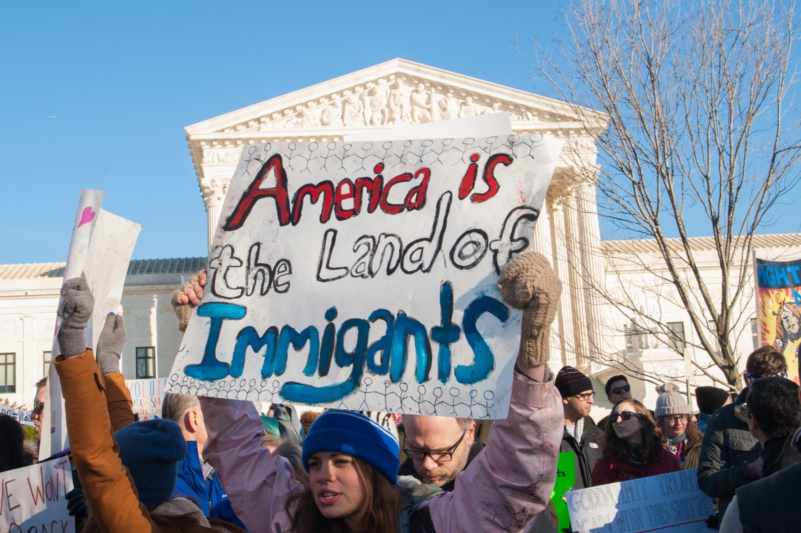
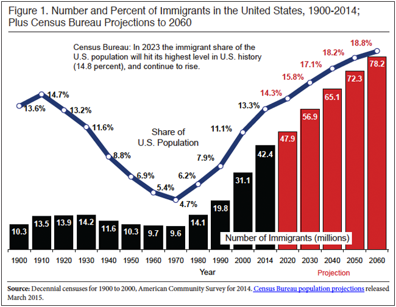

# Lab1-Migration
# Migration and the US
#####_Why does America become as the largest immigrant country? The US currently has the largest number of foreign-born residents in the
world and the highest rate of immigrant over the world from the last 40 years til now._

## Section 1: Migration and related problem
1. A relocation of residence from one political jurisdiction to another
2. Does distance matter?
- Are long distance moves more/less consequential for places and people than short distance moves?
3. Does level of “control” or regulation of jurisdictional borders matter for how we assess migration?
- Does crossing international borders make migration distinct from internal migration? 
- Is it only international migration that is controlled?

## Section 2: Migration Occurs at Multiple Spatial Scales
###1. Scales of migration
- Local (e.g. moving within a city – no change of job or social
networks required)
- Regional (e.g. crossing county lines within a state – sufficient
distance to break networks, change job location)
- National (e.g. state-to-state migration)
- International (e.g. from one country to another)
- Most moves are short distance: local, regional

###2. But we focus on international immigrant to the US
- are “aliens” admitted to the United States for lawful permanent residence.
- they may be issued immigrant visas overseas by the Department of State or adjusted to permanent resident status in the United States by US Bureau of CIS.

###3. Defind of immigration 
- defined as the number of immigrants arriving during a
specified period of time, such as a year or a decade
- going beyond official definitions: anybody in the US for > a certain period of time e.g. a temp worker on an H1-B could be in the country for 10 years before adjusting status to lawful permanent residence

## Section 3: Reasons of immigration and its flow

###1. Those who have moved because of:
- jobs/opportunity
- they are “tied” to those seeking jobs/opportunity
- persecution, war, famine, poverty, disaster
- not on those whose relocation to the US was because of enslavement
 An emphasis on immigration over the last 50 years but also an engagement with prior immigration and reactions to it

###2. Immigrant stock and flow

- The inflow of legal immigrants (those issued legal permanent residence) is about 1m per
year.
• But this is not an addition of 1m a year to immigrant stock!
• US residents also leave the US ~400,000 a year in late 1990s
• So net-migration to US (inflow-outflow) is ~ 600,000
– The unauthorized flow was 850,000 per year in mid 2000s; down to 300,000 a year by 2010

## References
- [Reference 1](https://www.pewresearch.org/short-reads/2020/08/20/key-findings-about-u-s-immigrants/)
- [Reference 2](https://canvas.uw.edu/courses/1634022)
- [Reference 3](https://metrocosm.com/us-immigration-history-map.html)

## See also
1. [Reference 1](https://nygal.com/ice-cracks-down-in-nyc-while-covid-rages-on/)
2. [Reference 2](https://cis.org/Report/HartCeller-Immigration-Act-1965)
3. [Reference 3](https://www.pewresearch.org/hispanic/2020/08/20/facts-on-u-s-immigrants/)
